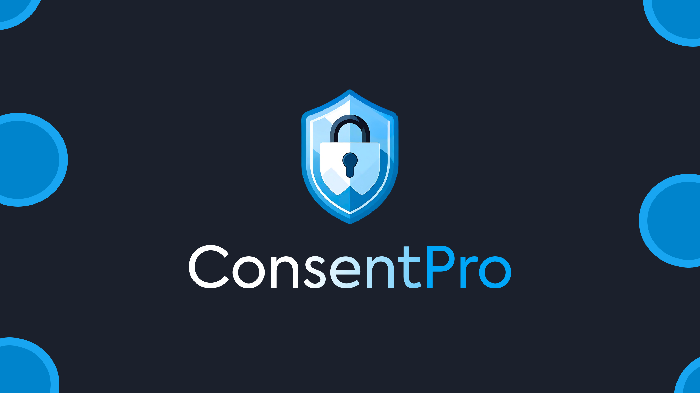

# ConsentPro



Simplify data privacy compliance with ConsentPro. Our platform provides automated consent management tools to help Philippine businesses comply with NPC Circular No. 2023-04.

This is a web application built with SvelteKit to provide a user-friendly interface for managing user consent for data processing, tailored to the requirements of Philippine regulations.

## ✨ Features

-   **Automated Consent Management:** Streamline the process of obtaining, storing, and managing user consent.
-   **Compliance-focused:** Specifically designed to help businesses in the Philippines adhere to NPC Circular No. 2023-04.
-   **User-Friendly Interface:** Easy-to-use dashboard for both administrators and end-users.
-   **Customizable Consent Forms:** Create and customize consent forms to fit your business needs.

## 🛠️ Tech Stack

-   **Framework:** [SvelteKit](https://kit.svelte.dev/)
-   **Language:** [TypeScript](https://www.typescriptlang.org/)
-   **Styling:** [Tailwind CSS](https://tailwindcss.com/)
-   **Deployment:** [Vercel](https://vercel.com/)

## 🚀 Getting Started

Once you've cloned the project and installed dependencies with `npm install` (or `pnpm install` or `yarn`), start a development server:

```bash
npm run dev

# or start the server and open the app in a new browser tab
npm run dev -- --open
```

## Building

To create a production version of your app:

```bash
npm run build
```

You can preview the production build with `npm run preview`.

> To deploy your app, you may need to install an [adapter](https://kit.svelte.dev/docs/adapters) for your target environment. This project is optimized for Vercel.
